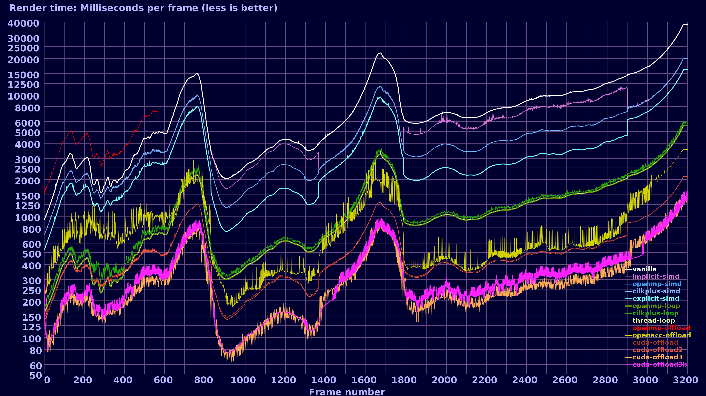

# cpp_parallelization_examples
The study &amp; production material for the video series:

* https://www.youtube.com/watch?v=Pc8DfEyAxzg (Parallelism in C++ :: Part 1/3: SIMD (multitasking on single core / vector mathematics)
* https://www.youtube.com/watch?v=MfEkOcMILDo (Parallelism in C++ :: Part 2/3: Threads (hyperthreading, multiple cpu cores)
* https://www.youtube.com/watch?v=kIA_UtdVabQ (Parallelism in C++ :: Part 3/3: Offloading (OpenMP, OpenACC, CUDA)

Note that commit *0680aa19f50f4198f3d36d30fe778a50331f9bf5* is
the state the programs were when episode 3 was released.
After that, the example programs have been updated, bugs fixed etc.

Current timings chart on Bisqwit’s computer:


## Program list:

* mandelbrot-vanilla: Vanilla algorithm without any parallelisation attempts.  Simple Mandelbrot fractal rendering with some very basic optimizations that will be identical across all the other programs in this list.
* mandelbrot-implicit-simd: Same as mandelbrot-vanilla, but rewritten as if it were SIMD; to attract SIMD optimizations in a compiler to manifest.
* mandelbrot-openmp-simd: Same as mandelbrot-implicit-simd, but with OpenMP SIMD pragmas to help the compiler add SIMD optimization where they most probably would help
* mandelbrot-cilkplus-simd: Same as mandelbrot-openmp-simd, but with CilkPlus pragmas rather than OpenMP pragmas
* mandelbrot-explicit-simd: Same as mandelbrot-implicit-simd, but completely rewritten with Intel Intrinsics.
* mandelbrot-openmp-loop: Same as mandelbrot-vanilla, but add OpenMP pragma for simple per-scanline threading.
* mandelbrot-cilkplus-loop: Same as mandelbrot-openmp-loop, but with CilkPlus equivalents.
* mandelbrot-thread-loop: Same as mandelbrot-openmp-loop, but using C++11 standard threads rather than pragmas. Algorithm is identical.
* mandelbrot-openmp-offload: Same as mandelbrot-vanilla, but with minimal correct implementation at OpenMP offloading.
* mandelbrot-openacc-offload: Same as mandelbrot-vanilla, but with minimal correct implementation at OpenACC offloading.
* mandelbrot-cuda-offload: Same as mandelbrot-vanilla, but with minimal correct implementation at CUDA offloading.
* mandelbrot-cuda-offload2: Same as mandelbrot-cuda-offload, but with small optimizations to get better performance.
* mandelbrot-cuda-offload3: A mixture between mandelbrot-cuda-offload2, mandelbrot-thread-loop, and mandelbrot-explicit-simd.
* mandelbrot-cuda-offload3b: Same as mandelbrot-cuda-offload3, but with small changes to threading logic in attempt to get better performance. (It failed.)

## Misc. instructions

### Build OpenMP programs

Add `-fopenmp` to both compiler and linker commandlines

When offloading, you may get linker problems from math functions
if you do an optimized build. To resolve, add `-foffload=-lm -fno-fast-math -fno-associative-math`

### Build CilkPlus programs

Add `-fcilkplus` to both compiler and linker commandlines, and `-lcilkrts` to linker commandline

### Build OpenACC programs

Add `-fopenacc` to both compiler and linker commandlines

When offloading, you may get linker problems from math functions
if you do an optimized build. To resolve, add `-foffload=-lm -fno-fast-math -fno-associative-math`

### Build thread programs

Add `-pthread` to linker commandline

### Build CUDA programs

* Use nvcc
* Add `-x cu` if your filename extension is something other than `.cu`

### Run OpenACC offloading programs

Add one or more environment variables before running the program, to control offloading:

* Optional: `LD_LIBRARY_PATH=/usr/local/lib64`
* Optional: `ACC_DEVICE_TYPE=<type>`
* Optional: `GOMP_DEBUG=1`

Possible device types:
* `hsa` for HSA
* `nvidia` or `nvptx` for NVidia PTX
* `mic` or `intelmic` for Intel MIC (possibly emulator)
* `host` for running on host

More information: https://gcc.gnu.org/wiki/Offloading

### Run OpenMP offloading programs

Add one or more environment variables before running the program, to control offloading:

* `OMP_DEFAULT_DEVICE=<number>`
* `LD_LIBRARY_PATH=/usr/local/lib64`
* Optional: `OMP_DISPLAY_ENV=true`
* Optional: `GOMP_DEBUG=1`

Mapping between device numbers and offloading targets:
Unknown, I found them experimentally. In any case, they start from 0 upwards.

### Installing CUDA compiler:

```
apt-get install nvidia-cuda-toolkit
```

### Building offloading-ready GCC:

More information: https://gcc.gnu.org/wiki/Offloading

ATTENTION: Do *not* just dump all this into your shell as a copypaste.
You need to understand what you are doing.

```
# Download and install NVidia PTX target tools
cd /usr/local/src
git clone https://github.com/MentorEmbedded/nvptx-tools
cd nvptx-tools
./configure
make -j8
make install

# Download and install HSA library and drivers
# Note: This has changed. See https://github.com/RadeonOpenCompute for new instructions.

cd /usr/local/src
git clone https://github.com/HSAFoundation/HSA-Runtime-AMD.git
dpkg -i HSA-Runtime-AMD/ubuntu/hsa-runtime*_amd64.deb
git clone -b kfd-v1.6.x https://github.com/HSAFoundation/HSA-Drivers-Linux-AMD.git
echo 'KERNEL=="kfd", MODE="0666"' | sudo tee /etc/udev/rules.d/kfd.rules
dpkg -i HSA-Drivers-Linux-AMD/kfd*/ubuntu/libhsakmt*.deb

# Let’s build GCC. Go to a suitable build directory with enough free space
cd /dev/shm

# Download and extract GCC source code
wget ftp://ftp.gwdg.de/pub/misc/gcc/releases/gcc-7.1.0/gcc-7.1.0.tar.bz2
tar xvfj gcc-7.1.0.tar.bz2
cd gcc-7.1.0

# Download Newlib port for NVPTX
git clone https://github.com/MentorEmbedded/nvptx-newlib newlib

# Build NVidia PTX offloading compiler
rm -rf build # Still in the gcc-7.1.0 directory
mkdir build
cd build
../configure \
        --target=nvptx-none --enable-as-accelerator-for=x86_64-linux-gnu \
        --disable-sjlj-exceptions --enable-newlib-io-long-long \
        --enable-checking=yes,df,fold,rtl \
        --enable-languages=c,c++,lto --with-build-time-tools=/usr/local/nvptx-none/bin
make -j8
make install

# Build MIC offloading compiler & emulator
# Add --disable-bootstrap to configure to make the build time shorter
rm -rf * # Still in the "build" directory
../configure  \
        --build=x86_64-intelmicemul-linux-gnu --host=x86_64-intelmicemul-linux-gnu \
        --target=x86_64-intelmicemul-linux-gnu --enable-as-accelerator-for=x86_64-linux-gnu \
        --enable-liboffloadmic=target \
        --enable-languages=c,c++,lto
make -j8
make install

# Build the actual compiler, with support for both targets
# Add --disable-bootstrap to configure to make the build time shorter
# If you want to support HSA, add --with-hsa-runtime=/opt/hsa to configure
# If you want to support HSA, add also ,hsa to the --enable-offload-targets parameter.
# Add any languages you need into --enable-languages
rm -rf * # Still in the "build" directory
../configure  \
        --build=x86_64-linux-gnu --host=x86_64-linux-gnu --target=x86_64-linux-gnu \
        --enable-offload-targets=x86_64-intelmicemul-linux-gnu,nvptx-none=/usr/local/nvptx-none \
        --enable-languages=c,c++,lto,jit --enable-lto --enable-host-shared \
        --enable-liboffloadmic=host \
        --with-cuda-driver=/usr
make -j8
make install
```
